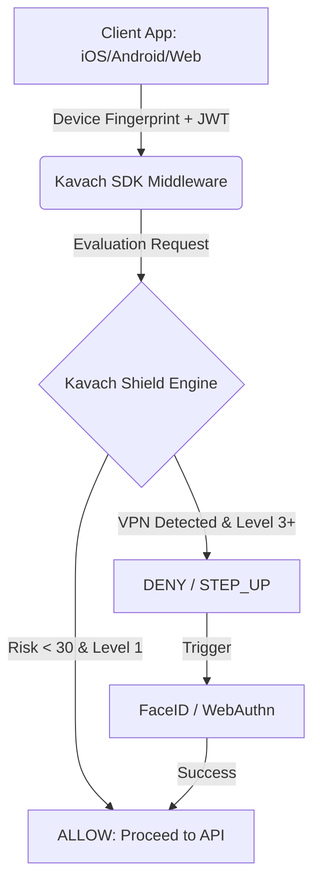

# The Kavach Ecosystem

Welcome to the **Kavach Ecosystem** — a modern, adaptive identity and security platform. 

Kavach acts as both an Enterprise B2B Platform (offering Identity & Risk APIs to external developers) and a tightly integrated consumer product suite (Wallet, Travel, Store, Rewards).

---

## 🏛️ Architecture & Philosophy

The core philosophy of Kavach is **"Secure by Default, Configurable by Exception"**.

We achieve this through the **Kavach Shield Engine (KSE)**. Instead of showing users a CAPTCHA or an OTP prompt on every single screen, Kavach silently scores every API request in the background.



### What We Provide By Default
*   **Device Trust:** Fingerprints are sent on every request. If the fingerprint changes unexpectedly, risk scores spike.
*   **Network Intelligence:** KSE detects Tor, VPNs, and datacenter IPs.
*   **Dynamic Step-Ups:** If a user tries to transfer money (Level 3 action) from a new country, they will hit a `STEP_UP_REQUIRED` response, prompting a biometric check.

### What You Can Configure
Through the `admin-console`, businesses can override the default strictness. For example, you can set `Kavach Store` to bypass strict VPN checks for "Browsing Catalog" actions, reducing friction for new shoppers.

### Deployment Models (SaaS vs Self-Hosted)
**Do developers need to deploy this server themselves?** No! 
*   **Kavach Cloud (SaaS):** Developers can simply sign up for a Kavach Tenant, install the SDK, and point it to the Kavach Cloud API. No server deployment required!
*   **Self-Hosted:** For strict data compliance, enterprises can deploy the Kavach `src/` backend in their own Kubernetes cluster or AWS environment using the provided Docker configuration.
*   **Local Device Execution:** The frontend Kavach SDK handles all biometric prompts (FaceID/TouchID), WebAuthn, and Device Fingerprinting 100% locally on the mobile device or web browser before securely transmitting the telemetry.

---

## 📁 Repository Navigation

The repository is organized into distinct domains:

| Directory | Description |
| :--- | :--- |
| `src/` | The core backend. Contains Kavach ID (Auth) and the Kavach Shield Engine (KSE). |
| `sdks/` | The multi-platform native libraries (`kavach-web`, `kavach-react-native`, `kavach-ios`, `kavach-android`, `kavach-flutter`, `kavach-python`, `kavach-go`). |
| `admin-console/` | The React dashboard used to configure KSE risk policies and RBAC. |
| `samples/` | Implementation examples for various platforms (see below). |

---

## 📱 Sample Integrations

We provide boilerplate implementations to demonstrate how to use Kavach across any tech stack. Explore the `samples/` directory:

*   **[`samples/kavach-react`](./samples/kavach-react):** Integrating the SDK into a React web app.
*   **[`samples/kavach-react-native`](./samples/kavach-react-native):** Mobile authentication and native biometrics.
*   **[`samples/kavach-ios`](./samples/kavach-ios):** Native Swift implementations.
*   **[`samples/kavach-android`](./samples/kavach-android):** Native Kotlin examples.
*   **[`samples/kavach-flutter`](./samples/kavach-flutter):** Cross-platform Dart implementation.
*   **[`samples/kavach-express`](./samples/kavach-express):** Protecting backend Node.js APIs using the SDK's Express Middleware.

### How to Run & Test the Samples
To test the "Invisible Security" and KSE biometric step-ups locally:

1. Ensure the Kavach Backend is running (see Local Setup below).
2. Navigate to your desired sample (e.g., React):
   ```bash
   cd samples/kavach-react
   npm install
   npm run start
   ```
3. Open the app in your browser/emulator.
4. **Test the feature:** Try clicking a "View Catalog" button (Level 1) — it will succeed silently. Then click "Transfer $500" (Level 3). The KSE engine on the backend will return a `401 STEP_UP_REQUIRED`, and the frontend SDK will automatically pop up your device's biometric scanner (TouchID/FaceID) to authorize the transaction!

---

## 🛠️ Local Setup & Deployment

To run the Kavach Shield Engine and Identity Provider locally:

### 1. Database Initialization
Kavach requires PostgreSQL. You can spin up the local Docker database:
```bash
docker compose up -d db
```

### 2. Push Schema
Initialize the database tables (Users, Tenants, Risk Profiles, Policies):
```bash
npx prisma db push
npx prisma generate
```

### 3. Start the Server
```bash
npm install
npm run start:dev
```
*The server will start on `http://localhost:3000`.*

### 4. Verify KSE Integration
You can run the mock integration test to verify the VPN and Policy engine logic:
```bash
npx ts-node test-kse.ts
```

---

## 📦 Publishing the SDKs

The Kavach ecosystem uses a suite of automated shell scripts to publish your SDKs to their respective global registries.

### Web & React Native (NPM)
```bash
./publish.sh
```
*Publishes `@rajeev02/kavach-web` and `@rajeev02/kavach-react-native` to the NPM Registry.*

### iOS (CocoaPods)
Navigate to `sdks/kavach-ios` and run:
```bash
pod trunk push KavachSDK.podspec
```

### Android (Maven Central)
Navigate to `sdks/kavach-android` and run:
```bash
./gradlew publishToMavenLocal # For local testing
# Or configure Sonatype credentials for Maven Central
```

### Flutter (Pub.dev)
```bash
./publish-flutter.sh
```

### Python (PyPI)
```bash
./publish-python.sh
```

### Go (Go Proxy)
```bash
./publish-go.sh v1.0.0
```
*Automatically tags the repository so the global Go Proxy indexes the new module version.*


## 🌐 The Kavach Ecosystem
Kavach provides native SDKs for all major platforms:
- [🌍 Web SDK](https://github.com/Rajeev02/kavachid/tree/main/sdks/kavach-web)
- [📱 React Native SDK](https://github.com/Rajeev02/kavachid/tree/main/sdks/kavach-react-native)
- [🍎 iOS SDK (Swift)](https://github.com/Rajeev02/kavachid/tree/main/sdks/kavach-ios)
- [🤖 Android SDK (Kotlin)](https://github.com/Rajeev02/kavachid/tree/main/sdks/kavach-android)
- [🐦 Flutter SDK](https://github.com/Rajeev02/kavachid/tree/main/sdks/kavach-flutter)
- [🐍 Python SDK (Backend)](https://github.com/Rajeev02/kavachid/tree/main/sdks/kavach-python)
- [🐹 Go SDK (Backend)](https://github.com/Rajeev02/kavachid/tree/main/sdks/kavach-go)
