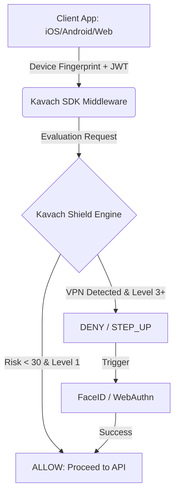

# The Kavach Ecosystem

Welcome to the **Kavach Ecosystem** — a modern, adaptive identity and security platform. 

Kavach acts as both an Enterprise B2B Platform (offering Identity & Risk APIs to external developers) and a tightly integrated consumer product suite (Wallet, Travel, Store, Rewards).

---

## 🏛️ Architecture & Philosophy

The core philosophy of Kavach is **"Secure by Default, Configurable by Exception"**.

We achieve this through the **Kavach Shield Engine (KSE)**. Instead of showing users a CAPTCHA or an OTP prompt on every single screen, Kavach silently scores every API request in the background.



### What We Provide By Default
*   **Device Trust:** Fingerprints are sent on every request. If the fingerprint changes unexpectedly, risk scores spike.
*   **Network Intelligence:** KSE detects Tor, VPNs, and datacenter IPs.
*   **Dynamic Step-Ups:** If a user tries to transfer money (Level 3 action) from a new country, they will hit a `STEP_UP_REQUIRED` response, prompting a biometric check.

### What You Can Configure
Through the `admin-console`, businesses can override the default strictness. For example, you can set `Kavach Store` to bypass strict VPN checks for "Browsing Catalog" actions, reducing friction for new shoppers.

---

## 📁 Repository Navigation

The repository is organized into distinct domains:

| Directory | Description |
| :--- | :--- |
| `src/` | The core backend. Contains Kavach ID (Auth) and the Kavach Shield Engine (KSE). |
| `kavach-sdk/` | The NPM library (`@rajeev02/kavach-sdk`). Used to integrate Kavach into Node/Frontend apps. |
| `admin-console/` | The React dashboard used to configure KSE risk policies and RBAC. |
| `samples/` | Implementation examples for various platforms (see below). |

---

## 📱 Sample Integrations

We provide boilerplate implementations to demonstrate how to use Kavach across any tech stack. Explore the `samples/` directory:

*   **[`samples/kavach-react`](./samples/kavach-react):** Integrating the SDK into a React web app.
*   **[`samples/kavach-react-native`](./samples/kavach-react-native):** Mobile authentication and native biometrics.
*   **[`samples/kavach-ios`](./samples/kavach-ios):** Native Swift implementations passing telemetry headers.
*   **[`samples/kavach-android`](./samples/kavach-android):** Native Kotlin examples.
*   **[`samples/kavach-flutter`](./samples/kavach-flutter):** Cross-platform Dart implementation.
*   **[`samples/kavach-express`](./samples/kavach-express):** Protecting backend Node.js APIs using the SDK's Express Middleware.

---

## 🛠️ Local Setup & Deployment

To run the Kavach Shield Engine and Identity Provider locally:

### 1. Database Initialization
Kavach requires PostgreSQL. You can spin up the local Docker database:
```bash
docker compose up -d db
```

### 2. Push Schema
Initialize the database tables (Users, Tenants, Risk Profiles, Policies):
```bash
npx prisma db push
npx prisma generate
```

### 3. Start the Server
```bash
npm install
npm run start:dev
```
*The server will start on `http://localhost:3000`.*

### 4. Verify KSE Integration
You can run the mock integration test to verify the VPN and Policy engine logic:
```bash
npx ts-node test-kse.ts
```

---

## 📦 Publishing the SDK

To publish updates to the `@rajeev02/kavach-sdk` NPM package:

1. Ensure you are logged into NPM (`npm login`).
2. Run the deployment script:
```bash
./publish.sh
```
